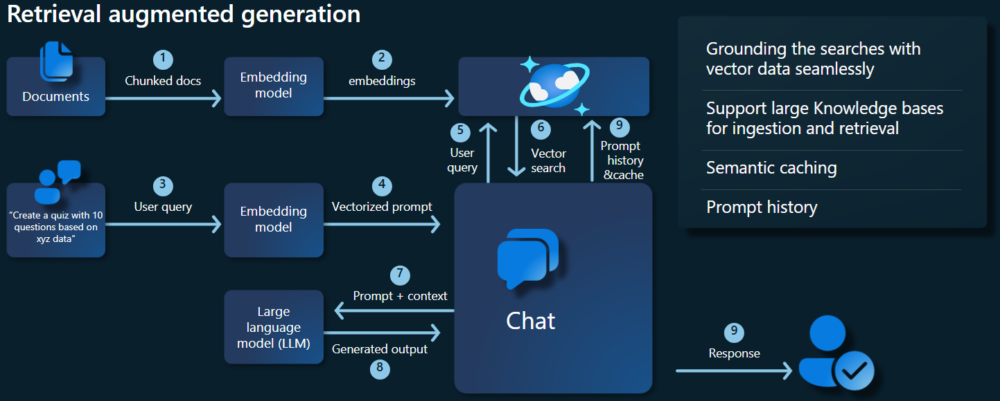
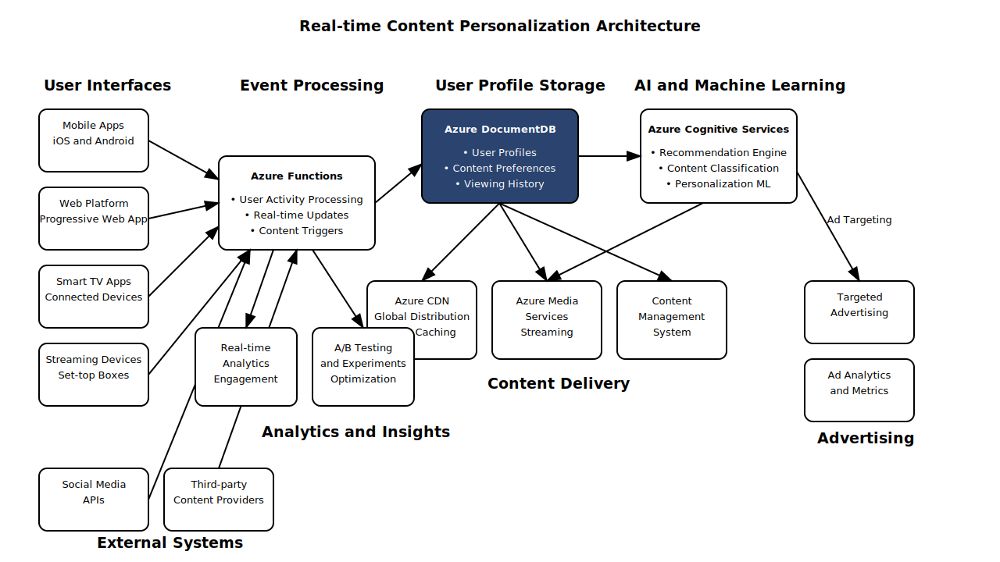

# Full Walkthrough

A complete end-to-end walkthrough covering setup, architecture, and deployment.

## Step 1: Choose Your Language

- TypeScript: 

## Step 2: Review the Architecture

## Step 3: Deploy the Solution

