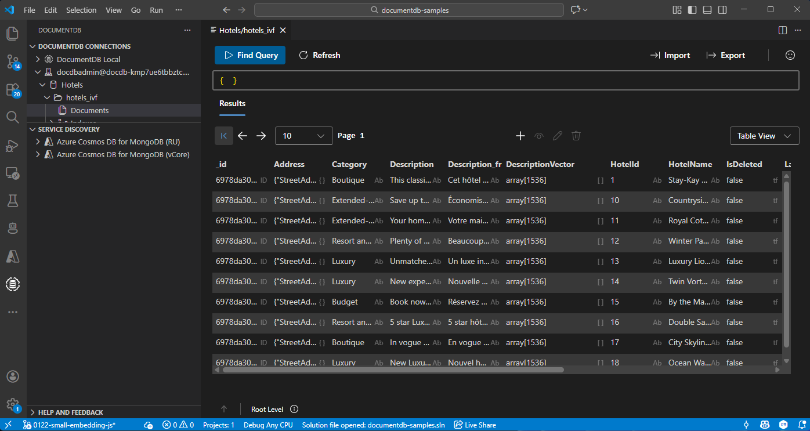

# Getting Started

Welcome to the getting started guide.

## Prerequisites

Make sure you have the following tools installed:

- TypeScript 

## Setting Up Your Environment

Use Visual Studio Code with the DocumentDB extension to connect to your database.

